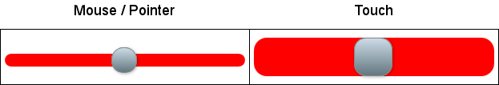
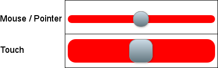

Mouse / Touch Range Slider
============================

## jQuery plugin that provides:

* Selection of one value within a predefined range per range slider (the plugin does not support dual sliders)
* There can be multiple range sliders on a page.
* Operation with mouse, stylus, and touch events.
* Minimum operation.
    * No values are displayed by the plugin.
        * *An onChange event is included that can be used to do something with the new value to indicate there has been a change.*
* Automatic resizing of the range slider (using the resize event) for responsive layouts.

## Demos

[Simple demo](http://richdebourke.github.io/mouse-touch-range-slider/simple.html) – demo of the plugin functionality with a single range slider

[Extended demo](http://richdebourke.github.io/mouse-touch-range-slider/index.html) – demo of the plugin functionality with multiple range sliders

[In operation](http://goo.gl/4Huz36) – plugin in use on a website

## Dependencies
jQuery 2.X or 3.X — The plugin works with the slim build version of jQuery 3.X.

## Browser compatibility
The plugin only supports newer browsers including Internet Explorer from version 9 – it does not support IE8 or older.

## Usage

Include the plugin CSS (either as a file in the head section or incorporated into the page's CSS):

~~~~ html
<link href="mouse-touch-range-slider.css" rel="stylesheet">
~~~~

Include an input in a containing div for each range slider (*more about the input below*):

~~~~ html

    <input type="text" id="red-slider"
        class="slider" value="" name="slider"
        tabindex="2" />

~~~~

Add jQuery, the plugin, the JavaScript code to initiate the plugin, and code to do something when the slider is moved:

~~~~ javascript

~~~~

### Range Slider input
The plugin builds the range slider around an HTML input in a containing div using span tags that are attached to the containing div.

##### Source HTML

~~~~ html

    <input type="text" id="red-slider"
        class="slider" value="" name="slider"
        tabindex="2" />

~~~~

##### Generated HTML

~~~~ html

    
        
        
        
    
    <input type="text" id="slider" class="slider rs-hidden-input"
        value="" name="slider" tabindex="-1" readonly="">

~~~~

The class on the parent div (red in this case) can be used for applying specific styling to the range slider and track.

#### tabindex
To control the tab sequence for tabbing through the page elements, include a tabindex value in the input text box. The plugin will transfer that value to the slider element and replace it with -1 (which removes the input text box from the tab sequence). If no tabindex value is provided, the tabindex is set to zero.

##### Styling the range slider
The range slider can be styled to adjust the position, size, and color of track and slider as desired.

## Mobile friendly styling
To be considered [mobile friendly](https://developers.google.com/speed/pagespeed/insights/) by Google, touch targets, like the slider handle and the slider track, need to be at least 48 pixels wide by 48 pixels high. While a larger sized slider would work with a mouse, it would be (in my opinion) less attractive, so I use two styles, one for mouse / pointer devices and the other for touch capable devices.

##### Detecting touch devices
The `html` tag starts with a `no-touch` class:

~~~~ html
    <html class="no-touch">
~~~~

The class on the `html` tag is changed from `no-touch` to `touch` by a version of [mhulse's no-x.js](https://gist.github.com/mhulse/4704893) method in the head section if the device thinks it supports touch. In the unlikely event of a false-positive, the styling would result in touch styling on a non-touch device, which would still be operational:

~~~~ javascript
(function (win, doc, nav) {
    if (('ontouchstart' in win) || 
            (nav.maxTouchPoints &&
            nav.maxTouchPoints > 0)) {
        doc.documentElement.className =
            doc.documentElement.className.replace(/\bno-touch\b/,
                'touch');
    }
}(window, document, navigator));
~~~~

Apple Safari supports [`'ontouchstart' in window`](https://developer.apple.com/library/mac/documentation/AppleApplications/Reference/SafariHTMLRef/Articles/Attributes.html). The other major browsers support [`navigator.maxTouchPoints`](https://w3c.github.io/pointerevents/#extensions-to-the-navigator-interface).

##### Mobile CSS changes
For the styles that are different for touch displays, there are alternate styles based on touch or no-touch.
~~~~ css
.no-touch .rs {
    height: 50px;
}

.touch .rs {
    height: 54px;
}
~~~~

## Configuring the plugin

The plugin accepts the following parameters when it is initialized:

* **min** – Slider minimum value – integer – default value is 0 
* **max** – Slider maximum value – integer – default value is 100
* **initialValue** – Slider starting value – integer – default value is 0
* **keyboard** – Lets the user adjust the value using the arrow keys – Boolean – default is true
* **onCreate** – Optional – callback function that's called after a range slider is initiated.
* **onStart** – Optional – callback function that's called when a slider handle is touched (by the mouse or by touch).
* **onChange** – Optional – callback function that's called when a slider has changed its position (by the mouse or by touch).
* **onFinish** – Optional – callback function that's called after a slider finishes moving (after the mouseup or touchend event)
  * All callback functions are provided with a sliderDataObject that contains:
        * **input** – the original input object
        * **id** – id for the original input object
        * **min** – slider's minimum value
        * **max** – slider's maximum value
        * **value** – slider's current value

## Positioning the slider
The slider can be positioned programmatically by creating a handle to the slider:

~~~~ html
var sliderHandle = $("#slider").data("mtRangeSlider");
~~~~

To position the slider, use the update function to pass the new position (the value can be either an integer or a string (e.g. 50 or "50")):

~~~~ html
sliderHandle.update(50);
~~~~

## How the plugin works
This plugin is loosely based on Denis Ineshin's [ion.rangeSlider](https://github.com/IonDen/ion.rangeSlider), using his plugin structure and control methods.

For each input that is submitted to the plugin, a new instance of the MouseTouchRangeSlider function is created.

The plugin creates the track and slider and attaches them to the input's containing div. Listeners for mousedown, pointerdown, and keydown are attached to the track and slider.

Dragging a slider will change the range slider's value. Using the arrow keys (when a slider has focus) will move the slider one position. Clicking or tapping the track will also move the slider one position.

A listener for resize is attached to the window that will adjust the range slider's size if the window is resized.

## Revisions

#### 2021/01/01
Now using JavaScript `addEventListener` for pointer events (to support mouse, touch, and stylus) for most browsers (I use mouse events for IE 9 & 10, which don't support pointer events).

#### 2020/07/05
Verified to work with jQuery 3.5.1.

#### 2019/05/10
Verified to work with jQuery 3.4.1.

#### 1.1.1 – 2016/08/30
#### Added CSS for touch devices
Added CSS styling for touch devices and updated the two demos to support both touch and non-touch displays. 

#### 1.1 – 2016/08/25
#### Revised the callback functions
Version 1.0 used three callback functions:
* onStart – Called when a range slider was created
* onChange – Called when a slider position was changed
* onFinish – Called when a slider finished moving (on mouse or touch end)

Those callbacks were from the [plugin](https://github.com/IonDen/ion.rangeSlider) that was the basis for this plugin.

I've renamed the onStart call to onCreate and assigned the onStart call to a new point in the code. The four callback functions are:
* onCreate – Called when a range slider is created
* onStart – Called when a slider is touched
* onChange – Called when a slider position has changed
* onFinish – Called when a slider has finished moving (on mouse or touch end)

## Why another range slider plugin
There are a number of range slider plugins on GitHub, but they have capabilities I *don't* need for my application (e.g. filler bars that cover the left side of the slider, display of the current value as a tool-tip, and options for dual sliders (hi & low)).

My application is a [color contrast checker]() that supports both RGB and HLV, so there are six interconnected range sliders. A change of one range slider (e.g. red) can trigger a change in the values of three other range sliders (hue, saturation, and brightness value). An additional complication is as a slider is moving, I am continually updating the display for a number of calculations, so it wasimportant to minimize how much the plugin touches the DOM.

## Compatibility
The Mouse Touch Range Slider plugin has been confirmed to work as of August 2020 with the latest versions of:
* Chrome (mobile & desktop)
* Edge (desktop & Surface)
* Firefox (mobile & desktop)
* Android Internet
* Safari (mobile & desktop)
* IE 9, 10, & 11

## License
This plugin is provided under the [MIT license](http://opensource.org/licenses/mit-license.php).

This plugin is loosely based on Denis Ineshin's [ion.rangeSlider](https://github.com/IonDen/ion.rangeSlider), which is also provided under the [MIT License](http://opensource.org/licenses/mit-license.php).

